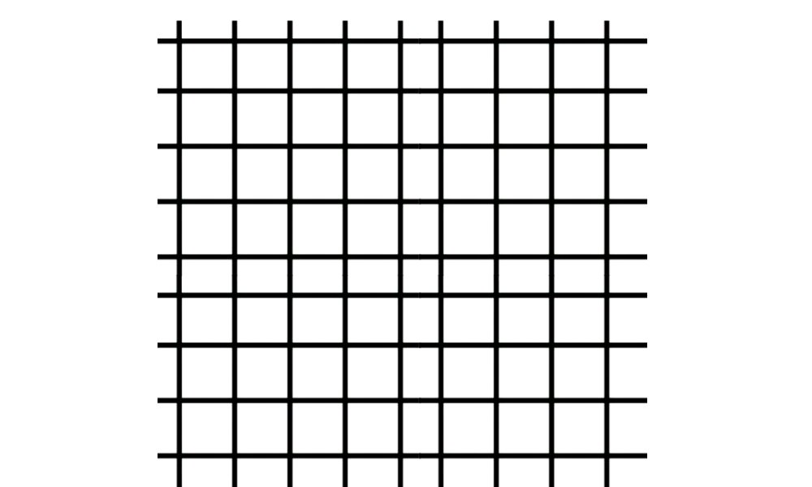

# 🧭 A* Pathfinding Robot Navigator

โปรเจคนี้คือการ Implement อัลกอริทึม A* (A-Star) ด้วยภาษา C# เพื่อใช้ในการค้นหาเส้นทางที่สั้นที่สุดสำหรับหุ่นยนต์แบบตาราง (Grid-based Environment) และนำเส้นทาง (Path) ที่ได้ไปสั่งการควบคุมหุ่นยนต์จริงในโปรแกรม Simulator

![[GIF of the robot solving the 9x9 grid]](./media/AstarDemo.gif)

---

## 🎯 เป้าหมายของโปรเจค

1.  **Implement Astar Algorithm:** สร้างอัลกอริทึม A* จากศูนย์ (Scratch) รวมถึงโครงสร้างข้อมูลที่จำเป็นอย่าง **Priority Queue**
2.  **Path Generation:** ใช้อัลกอริทึมค้นหาเส้นทางที่สั้นที่สุดจากจุดเริ่มต้น (Start) ไปยังจุดสิ้นสุด (End) โดยหลบหลีกสิ่งกีดขวาง
3.  **Robot Control:** แปลงผลลัพธ์ (รายการคู่อันดับ) ให้เป็น "คำสั่ง" ที่หุ่นยนต์เข้าใจได้ (เช่น `turnL()`, `turnR()`, `fd()`) เพื่อให้หุ่นยนต์วิ่งตามเส้นทางนั้น

---

## ✨ คุณสมบัติหลัก (Key Features)

* **Core Astar Algorithm:** Implement อัลกอริทึม A* อย่างถูกต้อง โดยใช้ **Manhattan Distance** เป็น Heuristic ($h(n)$)
* **Custom Priority Queue:** สร้าง `PriorityQueue` แบบง่าย (List-based) เพื่อจัดลำดับโหนดที่จะค้นหาตามค่า $F$ ($F = G + H$) ที่น้อยที่สุด
* **Scalable Grid:** แม้ในเดโมจะใช้สนาม 9x9 แต่ฟังก์ชัน `AStar()` ถูกออกแบบมาให้รับค่า `m` (แถว) และ `n` (หลัก) ทำให้สามารถประยุกต์ใช้กับสนามขนาด N*N ได้
* **Path-to-Movement Logic:** ฟังก์ชัน `followPath()` แสดงตรรกะการควบคุมหุ่นยนต์ โดยจะคำนวณทิศทางที่ต้องเลี้ยว (`turnSteps`) จากการเปรียบเทียบคู่อันดับปัจจุบันกับคู่อันดับถัดไป

---

## 🧠 หลักการทำงาน: A* (A-Star)

อัลกอริทึม A* ใช้ในการค้นหาเส้นทางที่สั้นที่สุด โดยการประเมินค่าใช้จ่าย ($F$) ของแต่ละช่องตาราง:

$f(n) = g(n) + h(n)$

* **$g(n)$:** ค่าน้ำหนักจริง (Cost) จากจุดเริ่มต้นไปยังโหนด $n$
* **$h(n)$:** ค่าประมาณการ (Heuristic) จากโหนด $n$ ไปยังจุดสิ้นสุด (ในโปรเจคนี้คือ Manhattan Distance)

### โครงสร้างข้อมูลหลัก

โค้ดนี้ใช้ `struct` ที่ชัดเจนในการเก็บข้อมูลแต่ละโหนด:

```csharp
struct Point
{
    public int X, Y;
}

// Node ที่ใช้เก็บค่า Cost สำหรับ A*
struct Node
{
    public int F, G, H; // F = G + H
    public Point Parent; // ใช้สำหรับ Trace กลับเพื่อหาเส้นทาง
    public bool InOpenList, InClosedList;
}

// Node สำหรับ Priority Queue
struct PQNode
{
    public Point Point;
    public int Priority; // (คือค่า F)
}
```

---

## 🗺️ สนามทดสอบ (The 9x9 Demo Grid)

ในโค้ด `setup()` มีการกำหนดสนามทดสอบขนาด 9x9 โดย `0` คือทางเดิน และ `1` คือสิ่งกีดขวาง (กำแพง)



```csharp
// Grid (0=Path, 1=Wall)
int[,] grid = new int[9, 9]
{
    { 0, 1, 1, 1, 0, 0, 1, 0, 0 },
    { 0, 0, 0, 1, 0, 0, 0, 1, 0 },
    { 1, 1, 0, 1, 0, 0, 1, 0, 1 },
    { 0, 1, 0, 0, 0, 1, 1, 1, 1 },
    { 0, 0, 1, 1, 0, 0, 0, 0, 0 },
    { 0, 1, 0, 0, 0, 0, 1, 0, 1 },
    { 0, 1, 1, 1, 1, 0, 1, 0, 1 },
    { 0, 1, 0, 0, 0, 0, 1, 0, 0 },
    { 0, 0, 0, 0, 0, 0, 1, 0, 0 }
};

Point start = new Point(1, 1);
Point end = new Point(5, 4);
```

---

## 🤖 ตรรกะการควบคุมหุ่นยนต์ (Robot Control Logic)

หลังจากที่ `AStar()` คืนค่า `List<Point> path` ออกมา ฟังก์ชัน `followPath()` จะทำงานดังนี้:

1.  วนลูปไปตาม "คู่" ของจุดในเส้นทาง (จุดปัจจุบัน `current` และจุดถัดไป `next`)
2.  คำนวณ `dx` และ `dy` เพื่อหาว่าทิศทางถัดไปคือ (ขึ้น `0`, ขวา `1`, ลง `2`, ซ้าย `3`)
3.  เปรียบเทียบทิศทางใหม่ (`nextHead`) กับทิศทางปัจจุบัน (`curHead`) เพื่อคำนวณ `turnSteps`
4.  สั่งเลี้ยวตาม `turnSteps` (`turnL()`, `turnR()`)
5.  สั่ง `track()` (เดินตามเส้น) และ `fd(100)` (เดินหน้า) เพื่อไปยังโหนดถัดไป

---

## 🛠️ Technology Stack

* **ภาษา:** C#
* **อัลกอริทึม:** A* (A-Star) Pathfinding
* **โครงสร้างข้อมูล:** Custom Priority Queue (List-based)
* **Platform:** c/c++ robot simulator สามารถดาวน์โหลดและดู document ได้ที่ http://www.krumon-robot.com/article/8/%E0%B8%81%E0%B8%B2%E0%B8%A3%E0%B8%95%E0%B8%B4%E0%B8%94%E0%B8%95%E0%B8%B1%E0%B9%89%E0%B8%87%E0%B9%82%E0%B8%9B%E0%B8%A3%E0%B9%81%E0%B8%81%E0%B8%A3%E0%B8%A1-c-robot-sim-full-v-1-0-130715-no-key

---

## 📄 License

This project is licensed under the MIT License.
